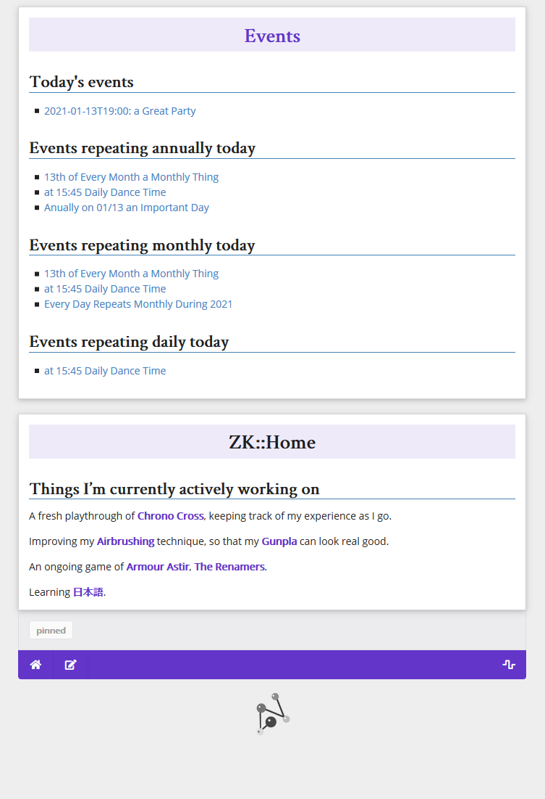

# Using Neuron to track today's events

I use Neuron, with the [dirtree](https://neuron.zettel.page/dirtree.html)
plugin, to keep track of events and help me remember important things, **when
using the [web interface](https://neuron.zettel.page/web.html).

This requires two things:

1. Using the dirtree plugin
2. Placing all 'event zettels' into the `events/` subdirectory (or name it
   whatever you like, but update these scripts appropriately)
3. Giving all 'event zettels' and ID that follows the format
   `event-YYYY-MM-DD[THH:MM]-NAME` (where `NAME` is replaced with the event's
   name, and `YYYY-MM-DD` is replaced with the ISO8601 formatted date for the
   event, and the time element is optional)
4. Adding this `events.js` to your `static/` directory, and linking to it from
   `head.html`
5. [Optional] adding these Vim functions to your `.vimrc` to help keep the
   filepaths and formatting of the event zettels consistent

## Event Zettel ID format

This format is important--if your events deviate from this, the JS will stop
picking them up (they'll still be perfectly good zettels though).

The ID **must** begin with `event-`, followed by the ISO8601 date (or an
ISO8601-like date with wildcards for recurring events), optionally including the
time in ISO8601 format, followed by the event's name.

### Examples

- An awesome party on 1st January, 2021, would have the ID `event-2021-01-01-awesome-part`.
- An extra awesome party, on December 9 2020 at 19:30 would have the ID
    `event-2020-12-09T19:30-extra-awesome-party`

### Wildcards for recurring events

If you want an event to recur annually, monthly, or even daily, you can use the
`yyyy`, `mm`, and `dd` wildcards in place of the appropriate date element.

Someone's birthday would look like this: `event-yyyy-06-21-sharons-birthday`

A monthly event for paying the rent would be `event-yyyy-mm-01-pay-rent`

And a daily reminder for working out could be `event-yyyy-mm-ddT06:00-work-out`
(there are no 'reminders' or notifications here (yet?), but if you want to keep
visibility of things this could be helpful).

There aren't day-of-the-week repetitions at this point. I'd like to add them
when I figure out a good way to do it.

## Vim functions

If you add these functions as-is to a `.vimrc`, you'll get two new editor
commands:

- `:ZE event-name YYYY-MM-DD[THH:MM] [tags]`
- `:ZEt event-name YYYY-MM-DD[THH:MM] [tags]`

The first creates a new event zettel in the current tab, the second does the
same in a new tab.

The created zettels will have the correct ID, and will have a title that
includes the date and the name.

For full dates, it will be rendered directly in ISO8601 format.

For recurring dates, the date will be rendered in a human-friendly style (i.e.
"Annually on 12/31").

Tags will be included in the frontmatter of the zettel.

